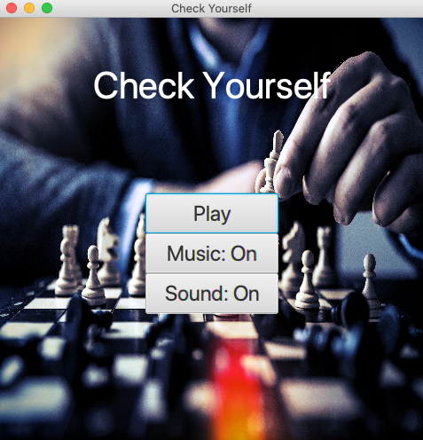

#  Check Yourself

> *Check Yourself* is a simple and minimalistic chess puzzle game where the player solves mate in one problems

 

- Designed for the casual player
- Contains 98 problems for the players to solve
- The player's progress persists throughout each launch, is reset after player reaches end of game
- Majority of the puzzles are from actual chess games, mostly of grandmaster level
- Uses the FEN chess notation format: [FEN](https://en.wikipedia.org/wiki/Forsyth%E2%80%93Edwards_Notation)
- Runs on MacOS (have not desinged for Windows, and have not tested on Linux)

## Gameplay

The game assumes you know the rules of chess and can read basic chess notation. You can find tutorials on these below, and don't worry 
chess is an easier game to learn than you think! Easy to learn, yet dificult to master.
- [How to play](https://www.chess.com/learn-how-to-play-chess)
- [Chess notation](https://www.chess.com/article/view/chess-notation)

In this game you will be asked to enter in a move as chess notation, and to have the sides seperated white pieces are all uppercase 
( P N B R Q K ) and black pieces are lowercase ( p n b r q k ). Other than that it is just normal notation and chess, I hope you enjoy!

## Adding Chess Problems

To add your own chess problems, simply take any board position in the FEN format and afterwards add a colon and the correct move,
for example:

```
r1b1qr2/5pBp/2p1p3/p1PpP1R1/P2N1P1k/2P5/6PP/3n2K1 w - - 8 31

then add the correct move to the end (following a colon) :nf3

r1b1qr2/5pBp/2p1p3/p1PpP1R1/P2N1P1k/2P5/6PP/3n2K1 w - - 8 31:Nf3
```

Then add this string to file in the resources folder "Problems.txt", and now it has been added to the game. 
To play the problem find the linenumber where it was added ( Problems.txt ) and go to that problem number in the game.

## Jumping to other puzzles

- To go to a specific problem number, edit the int value to the problem number in Current.txt
- To reset the game, change the int value in Current.txt to: 1

## Credits 

- Music: [Chris Zabriskie](https://chriszabriskie.bandcamp.com/)
- Text-to-Speech sound: https://ttsmp3.com/
- Background photos: https://www.pexels.com/search/chess/
- Photo editing: https://pixlr.com/
